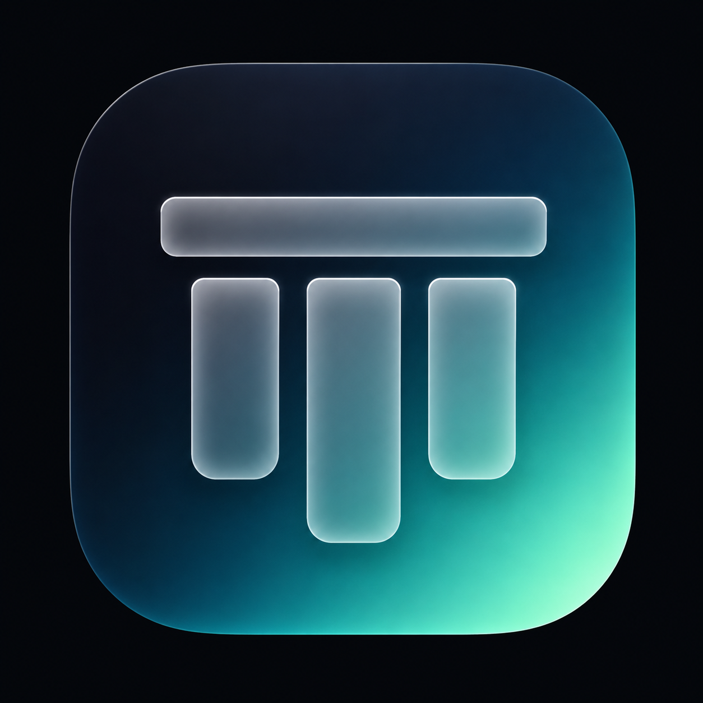

<p align="center">
  
</p>

<h1 align="center">Peristyle</h1>

<p align="center"><em>Your personal sanctuary on the web.</em></p>

A personal browser start page for Chrome and Edge. Replaces the new tab page with a clean, dark glassmorphic dashboard — your sites, search, clock, weather, and nothing else.

   

---

## Features

- **Site tiles** — organised into groups, drag to reorder, add/edit/delete at any time
- **Live clock & date** — always front and centre
- **Weather widget** — current conditions, feels like, wind, rain chance, and a 7-day forecast popup (powered by Open-Meteo, no API key required)
- **Theming** — 8 colour themes, custom accent colour, 6 font pairings, clock style options, tile opacity and blur sliders
- **Backgrounds** — built-in presets, custom image URL, pin your own images, or use the daily Bing photo automatically
- **Search** — Google search bar, press `/` anywhere to focus it
- **Edit mode** — press `E` or click the pencil icon; drag tiles between groups, rename groups, reorder groups
- **Backup & restore** — export your personal config as a `config.json` file and import it back on any machine
- **Update checker** — checks GitHub for a newer version on load; shows a badge on the settings icon when an update is available
- **First-run tutorial** — 8-step guided tour; can be replayed from Settings → General

---

## Installation

Peristyle is a sideloaded extension — it is not on the Chrome Web Store.

### First time setup

1. [Download the latest release](https://github.com/CNCow/Peristyle/archive/refs/heads/main.zip) as a ZIP
2. Extract the ZIP to a folder on your machine (somewhere permanent — the browser needs to keep pointing at it)
3. Open Chrome or Edge and go to `chrome://extensions` or `edge://extensions`
4. Enable **Developer mode** (toggle in the top-right corner)
5. Click **Load unpacked** and select the extracted folder
6. Open a new tab — Peristyle will appear with a set of sample tiles to get you started

### Updating to a new version

When a new version is available, a small red badge will appear on the settings icon in the bottom-right corner of your new tab page.

1. Open Settings and go to the **Updates** tab
2. Click **Download latest version** — this downloads a fresh ZIP from GitHub
3. Extract the ZIP and **replace the contents** of your existing extension folder with the new files
4. Go to `chrome://extensions` and click the **reload** button (↺) on the Peristyle card
5. Open a new tab — done

> **Tip:** If you store the extension folder in a synced location (OneDrive, Dropbox, etc.) you only need to update it once and all your machines will pick up the changes after a browser restart.

---

## Your personal config

All your settings — tiles, groups, theme, weather location — are stored in your browser's `localStorage` automatically as you make changes. Nothing is shared or synced anywhere.

On a fresh install, Peristyle starts with a set of built-in sample tiles. From there, set it up the way you like and use the export/import buttons to manage your own config:

- Click the **download** icon in the action bar (bottom-right) to save your current config as `config.json`
- Click the **upload** icon to restore a previously saved config on a new machine

> Your `config.json` is personal — it is not included in this repository. Keep your own copy somewhere safe if you want to be able to restore your setup.

---

## Settings overview

| Tab | What's in there |
|---|---|
| **General** | Peristyle name, show/hide title, link target (same or new tab), tutorial |
| **Appearance** | Colour theme, accent colour, font pairing, clock style, icon size, tile opacity & blur |
| **Background** | Built-in presets, daily Bing photo, custom URL, pinned images |
| **Weather** | Enable widget, search for your location, save coordinates |
| **Groups** | Add, rename, reorder, and delete groups |
| **Updates** | Current version, latest version, check now, download |

---

## Keyboard shortcuts

| Key | Action |
|---|---|
| `/` | Focus the search bar |
| `E` | Toggle edit mode |
| `Escape` | Close any open modal |
| `→` / `Enter` | Next tutorial step |
| `←` | Previous tutorial step |

---

## APIs & services used

| Service | Purpose | Key required? |
|---|---|---|
| [Open-Meteo](https://open-meteo.com) | Weather data & geocoding | No |
| [Bing Image of the Day](https://www.bing.com) | Optional daily background | No |
| [Google Favicons](https://www.google.com/s2/favicons) | Tile icons | No |
| [Google Fonts](https://fonts.google.com) | Typography | No |

---

## File structure

```
Peristyle/
├── manifest.json       # Extension manifest (Manifest V3)
├── peristyle.html      # Main page — markup and styles
├── peristyle.js        # All logic — state, rendering, settings, weather, updates
├── images/             # Any local custom tile icons (optional)
└── README.md
```

---

## License

GNU General Public License v3.0 — see [LICENSE](LICENSE) for details.
